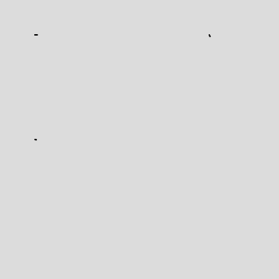

# p5.lerpShape.js 🎨

p5.js の標準的な図形描画を、`0.0` から `1.0` の進捗値（Progress）でスルスルと補間（Lerp）しながら描画できるようにするライブラリです。

「図形を描く過程」をアニメーションにしたい時に、複雑な計算をすることなく、既存のコードを囲むだけで動かせます。

## 🚀 特徴

- **既存コードへの高い親和性**: `withLerpShape()` で囲むだけで、中の `rect` や `ellipse` がアニメーション対応になります。
- **一貫した描画速度**: `vertex` や `rect` の描画速度を、頂点数ではなく「線の長さ」に基づいて計算するため、滑らかに動きます。
- **文字の変容**: 文字列をタイピング風に表示したり、別の文字列へ文字コード基準でモーフィングさせる `lerpString()` を搭載。
- **モード対応**: `rectMode()` や `ellipseMode()` の設定を自動的に反映します。

## 📦 使い方

### 基本的な描画

```javascript
function setup() {
  createCanvas(400, 400);
}
function draw() {
  background(220);

  let p = (frameCount % 100) / 100; // 0.0 ~ 1.0 の進捗

  // この関数で囲むだけで、中の図形が progress に応じて描画されます
  withLerpShape(p, () => {
    strokeWeight(2);
    noFill();

    rect(50, 50, 100, 100);
    line(50, 200, 300, 250);
    triangle(300, 50, 350, 150, 250, 150);
  });
}
```



## カスタムシェイプ (vertex)

beginShape / endShape にも対応しています。

```javascript
withLerpShape(p, () => {
  beginShape();
  vertex(20, 20);
  vertex(80, 20);
  vertex(80, 80);
  vertex(40, 90);
  endShape(CLOSE); // CLOSE をつけると最後の一辺も lerp 対象になります
});
```

## 文字のモーフィング (lerpString)

文字列から別の文字列へ、一文字ずつ変容させることができます。

```JavaScript
withLerpShape(p, () => {
textSize(32);
// 「Hello」が「こんにちは」にモーフィング
lerpString("Hello", "こんにちは", 50, 200);
});
```

## 🛠 対応している関数

- `line()`
- `rect()` (角丸は現在未対応)
- `ellipse() / circle()`
- `triangle()`
- `quad()`
- `arc()`
- `text()` (文字数が増えるアニメ)
- `lerpString()` (独自：文字列間のモーフィング)
- `beginShape() / vertex() / endShape()`

## 📖 インストール

HTML で p5.js を読み込んだ後に、本ライブラリを読み込んでください。

```HTML
<script src="https://cdn.jsdelivr.net/npm/p5@2/lib/p5.min.js"></script>
<script src="p5.lerpShape.js"></script>
```

<!-- ## 💡 開発の裏側
このライブラリは、人間と AI がペアプログラミングをしながら設計・開発されました。
「p5.js の内部状態をどう盗むか」「どうすれば計算を共通化できるか」といった試行錯誤のプロセスを経て誕生しました。 -->

## 📄 ライセンス

MIT License

---

## 🌟 Support the Project

If `p5.lerpShape` helped you create something cool, please consider giving it a **Star**!
It’s a huge encouragement for me to keep improving this library. 🚀

[](https://github.com/tkyko13/p5.lerpShape/stargazers)
